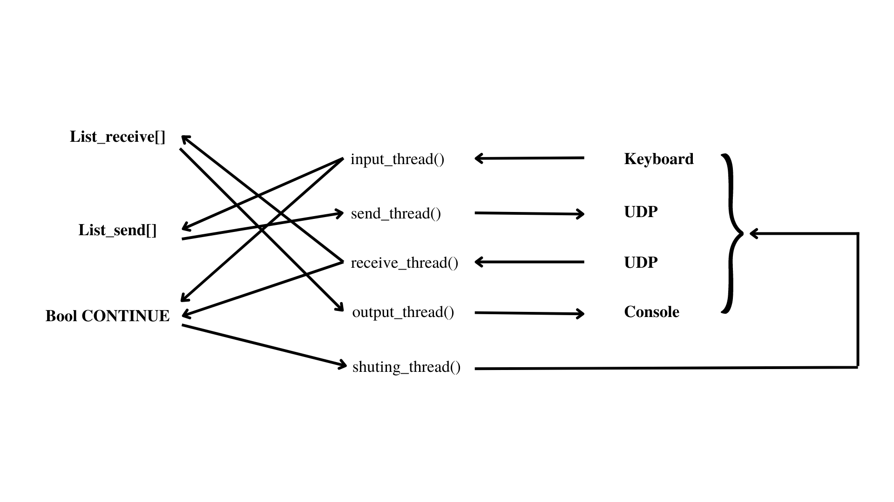

### Simon Fraser University

### School of Computing Science

# CMPT 300: Assignment 2

## IPC and Concurrency

Threads

- One of the threads does nothing other than await input from the keyboard and append it to `List messages_send`.
- Another thread takes an item from `List messages_send` sends data to the remote UNIX process over the network using UDP .
- Another thread does nothing other than await a UDP datagram and append it to `List messages_receive`.
- Another thread will take an item from `List messages_receive` and prints the characters to the screen.
- Finally, another thread will manage the SHUTDOWN, the closing the UDP server, and clean the memory used for each thread.



## Running

To run tests, run the following command on a LINUX machine.

```bash
    make
    ./s-talk [my port number] [remote CSIL machine name] [remote port number]
```

Example:

```bash
    s-talk 6060 csil-cpu3 6001
```

## Authors

- [@Joel del Castillo](https://www.github.com/joeldelcastillo)
